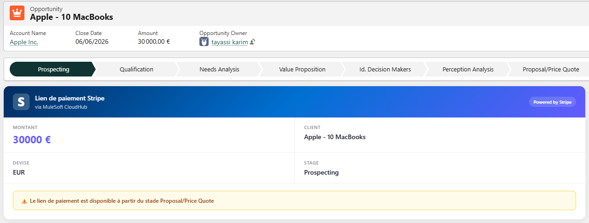
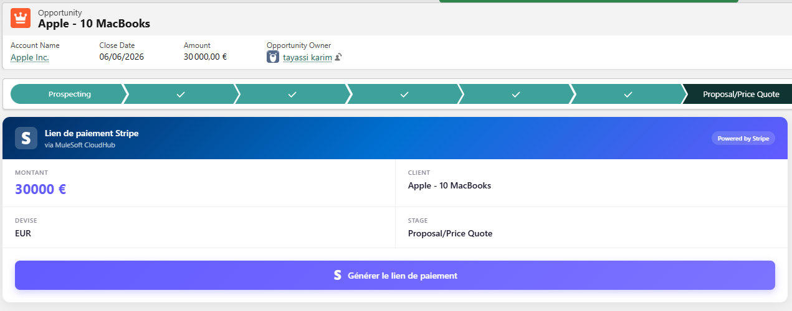
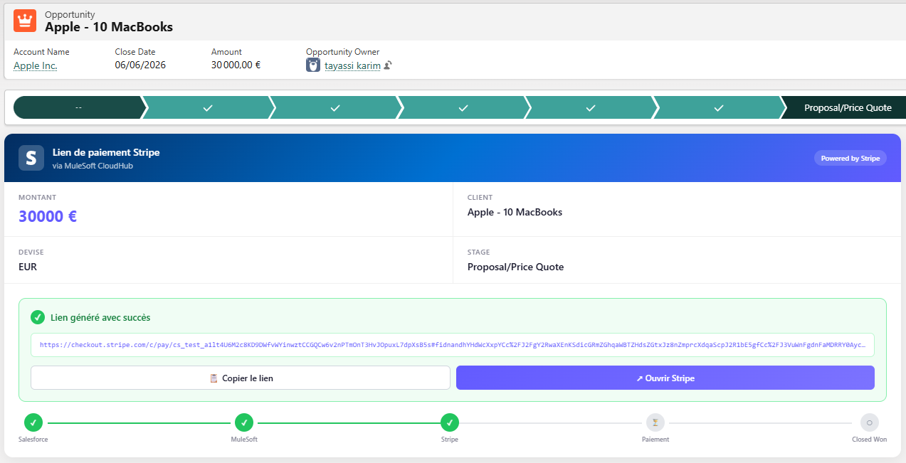
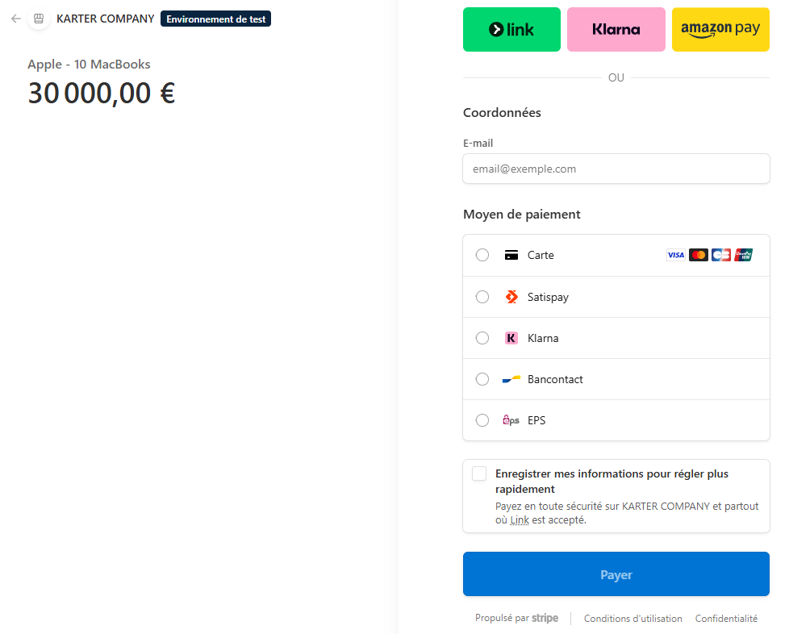
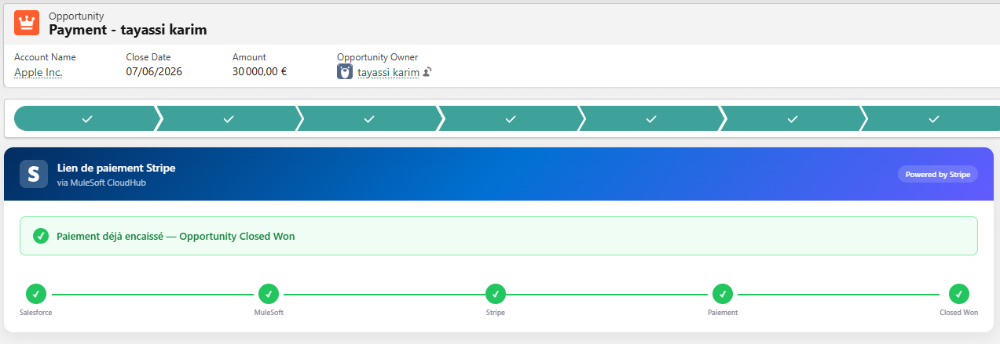

# Stripe Payment LWC — Salesforce Component

Composant Salesforce (LWC + Apex) permettant de générer un lien de paiement Stripe directement depuis une page Opportunity dans Salesforce.

> 👉 Ce composant appelle un endpoint MuleSoft déployé sur CloudHub. Le repo du middleware MuleSoft est disponible ici : [stripe-salesforce-mulesoft](https://github.com/KarterKiller/stripe-salesforce-mulesoft)

---

## Aperçu

### Avant paiement
Le composant affiche le montant et le nom du client depuis l'Opportunity, et génère un lien de paiement Stripe en un clic.

### Après paiement
Une fois l'Opportunity passée en Closed Won (automatiquement via webhook MuleSoft), le composant affiche un message de confirmation avec la timeline complète du flow.

---

## Flow d'intégration

```
┌─────────────────────────────────────────────────────────────┐
│                      Salesforce                             │
│                                                             │
│  Opportunity (Prospecting)                                  │
│  └── LWC: stripePaymentButton                               │
│       └── [Clic] Générer le lien de paiement                │
│            └── Apex: StripePaymentController                │
│                 └── POST /payment/create-session            │
│                      └── MuleSoft CloudHub                  │
│                           └── Stripe API                    │
│                                └── checkoutUrl              │
│                                     └── Affiché dans LWC    │
│                                                             │
│  Client paie → webhook Stripe → MuleSoft → Opportunity      │
│                                             Closed Won ✓    │
└─────────────────────────────────────────────────────────────┘
```

---

## Composants

### LWC — `stripePaymentButton`

Affiché sur la page Opportunity. Comportement :

- **Opportunity non payée** : affiche le montant, le client et le bouton "Générer le lien de paiement"
- **Lien généré** : affiche l'URL Stripe avec boutons "Copier" et "Ouvrir Stripe" + timeline du flow
- **Opportunity Closed Won** : affiche un message de confirmation + timeline complète en vert

### Apex — `StripePaymentController`

Callout HTTP vers l'endpoint MuleSoft `/payment/create-session`. Retourne l'URL de checkout Stripe au LWC.

---

## Installation

### Prérequis Salesforce

**1. Objets et champs custom**

Sur `Account` :
- `Stripe_Customer_ID__c` — Text 255, External ID + Unique

Sur `Opportunity` :
- `Stripe_Session_ID__c` — Text 255, External ID + Unique

Objet custom `Payment__c` avec les champs :
- `Stripe_Session_ID__c` — Text 255, External ID + Unique
- `Amount__c` — Number (16,2)
- `Currency__c` — Text 10
- `Status__c` — Text 50
- `Opportunity__c` — Lookup vers Opportunity
- `Account__c` — Lookup vers Account

**2. Remote Site Settings**

Setup → Remote Site Settings → New :
- **Name** : `MuleSoft_CloudHub`
- **URL** : `https://stripe-salesforce-integration-lxelir.5sc6y6-1.usa-e2.cloudhub.io`

**3. Déployer l'Apex Controller**

Setup → Apex Classes → New → coller le contenu de `StripePaymentController.cls`

**4. Déployer le LWC**

Setup → Lightning Web Components → New → créer `stripePaymentButton` avec les 3 fichiers (html, js, css)

**5. Ajouter le composant sur la page Opportunity**

Ouvrir une Opportunity → ⚙️ → Edit Page → glisser `stripePaymentButton` → Save → Activate

---

## Structure du repo

```
stripe-payment-lwc/
├── force-app/main/default/
│   ├── classes/
│   │   └── StripePaymentController.cls
│   └── lwc/
│       └── stripePaymentButton/
│           ├── stripePaymentButton.html
│           ├── stripePaymentButton.js
│           ├── stripePaymentButton.css
│           └── stripePaymentButton.js-meta.xml
└── README.md
```

---

## Configuration

L'URL de l'endpoint MuleSoft est hardcodée dans `StripePaymentController.cls` :

```apex
req.setEndpoint('https://stripe-salesforce-integration-lxelir.5sc6y6-1.usa-e2.cloudhub.io/payment/create-session');
```

Modifier cette URL si l'app MuleSoft est redéployée sur un nouveau domaine CloudHub.

---

## Screenshots

### LWC — Génération du lien de paiement


### LWC — Lien généré avec timeline


### LWC — Opportunity Closed Won


### LWC — Opportunity Closed Won


### LWC — Opportunity Closed Won


---

## Stack technique

| Composant | Technologie |
|---|---|
| Frontend Salesforce | Lightning Web Components (LWC) |
| Backend Salesforce | Apex (HTTP Callout) |
| Middleware | MuleSoft CloudHub |
| Payment gateway | Stripe Checkout |

---

## Points d'amélioration futurs

- **Named Credential** : remplacer l'URL hardcodée par une Named Credential Salesforce pour centraliser la config
- **Test Apex** : classe de test pour `StripePaymentController` avec mock HTTP
- **Multi-devise** : activer le multi-currency Salesforce pour gérer les devises dynamiquement

---

## Auteur

**Karim Tayassi** — Salesforce Developer & Integration Specialist  
Certifications : Salesforce Platform Developer I · AgentForce Specialist · MCD Level 1 (en cours)  
GitHub : [@KarterKiller](https://github.com/KarterKiller)


# Stripe Payment LWC — Salesforce Component

Salesforce component (LWC + Apex) that generates a Stripe payment link directly from an Opportunity page in Salesforce.

> 👉 This component calls a MuleSoft endpoint deployed on CloudHub. The MuleSoft middleware repo is available here: [stripe-salesforce-mulesoft](https://github.com/KarterKiller/stripe-salesforce-mulesoft)

---

## Overview

### Before payment
The component displays the opportunity amount and customer name, and generates a Stripe payment link in one click — available from **Proposal/Price Quote** stage onwards.

### After payment
Once the Opportunity is automatically moved to Closed Won (via MuleSoft webhook), the component displays a confirmation message with the full integration timeline in green.

---

## Integration Flow

```
┌─────────────────────────────────────────────────────────────┐
│                      Salesforce                             │
│                                                             │
│  Opportunity (Proposal/Price Quote or later)                │
│  └── LWC: stripePaymentButton                               │
│       └── [Click] Generate payment link                     │
│            └── Apex: StripePaymentController                │
│                 └── POST /payment/create-session            │
│                      └── MuleSoft CloudHub                  │
│                           └── Stripe API                    │
│                                └── checkoutUrl              │
│                                     └── Displayed in LWC    │
│                                                             │
│  Customer pays → Stripe webhook → MuleSoft → Opportunity    │
│                                               Closed Won ✓  │
└─────────────────────────────────────────────────────────────┘
```

---

## Components

### LWC — `stripePaymentButton`

Displayed on the Opportunity page. Behavior:

- **Stage too early** (Prospecting, Qualification, etc.) : warning message — payment link not available yet
- **Opportunity not yet paid** : displays amount, customer name and "Generate payment link" button
- **Link generated** : displays Stripe URL with "Copy" and "Open Stripe" buttons + integration timeline
- **Opportunity Closed Won** : displays confirmation message + full timeline in green

### Apex — `StripePaymentController`

HTTP callout to the MuleSoft endpoint `/payment/create-session`. Returns the Stripe checkout URL to the LWC.

---

## Screenshots

### LWC — Stage warning (Prospecting)


### LWC — Payment link generated


### LWC — Stripe checkout page


### LWC — Payment confirmed on Stripe


### LWC — Opportunity Closed Won


---

## Installation

### Salesforce Prerequisites

**1. Custom objects and fields**

On `Account`:
- `Stripe_Customer_ID__c` — Text 255, External ID + Unique

On `Opportunity`:
- `Stripe_Session_ID__c` — Text 255, External ID + Unique

Custom object `Payment__c` with fields:
- `Stripe_Session_ID__c` — Text 255, External ID + Unique
- `Amount__c` — Number (16,2)
- `Currency__c` — Text 10
- `Status__c` — Text 50
- `Opportunity__c` — Lookup to Opportunity
- `Account__c` — Lookup to Account

**2. Remote Site Settings**

Setup → Remote Site Settings → New:
- **Name**: `MuleSoft_CloudHub`
- **URL**: `https://stripe-salesforce-integration-lxelir.5sc6y6-1.usa-e2.cloudhub.io`

**3. Deploy Apex Controller**

Setup → Apex Classes → New → paste content of `StripePaymentController.cls`

**4. Deploy LWC**

Setup → Lightning Web Components → New → create `stripePaymentButton` with the 3 files (html, js, css)

**5. Add component to Opportunity page**

Open an Opportunity → ⚙️ → Edit Page → drag `stripePaymentButton` → Save → Activate

---

## Repo Structure

```
stripe-payment-lwc/
├── force-app/main/default/
│   ├── classes/
│   │   └── StripePaymentController.cls
│   └── lwc/
│       └── stripePaymentButton/
│           ├── stripePaymentButton.html
│           ├── stripePaymentButton.js
│           ├── stripePaymentButton.css
│           └── stripePaymentButton.js-meta.xml
└── README.md
```

---

## Configuration

The MuleSoft endpoint URL is hardcoded in `StripePaymentController.cls`:

```apex
req.setEndpoint('https://stripe-salesforce-integration-lxelir.5sc6y6-1.usa-e2.cloudhub.io/payment/create-session');
```

Update this URL if the MuleSoft app is redeployed to a new CloudHub domain.

---

## Tech Stack

| Component | Technology |
|---|---|
| Salesforce Frontend | Lightning Web Components (LWC) |
| Salesforce Backend | Apex (HTTP Callout) |
| Middleware | MuleSoft CloudHub |
| Payment Gateway | Stripe Checkout |

---

## Future Improvements

- **Named Credential**: replace hardcoded URL with a Salesforce Named Credential for centralized config management
- **Apex Test Class**: unit tests for `StripePaymentController` with HTTP mock
- **Multi-currency**: enable Salesforce multi-currency to handle currencies dynamically
- **Stage config**: make the minimum stage for payment link generation configurable via Custom Metadata

---

## Author

**Karim Tayassi** — Salesforce Developer & Integration Specialist  
Certifications: Salesforce Platform Developer I · AgentForce Specialist · MCD Level 1 (in progress)  
GitHub: [@KarterKiller](https://github.com/KarterKiller)
